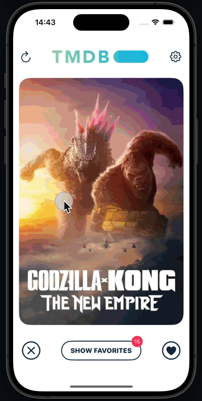

# Tinder-like Movie Match iOS Demo App

Discover and organize your favorite movies effortlessly. Swipe right to save a movie, swipe left to pass. Access detailed movie information with a simple tap. Enjoy support for 3 languages (English, Swedish, and Korean) and a sleek dark mode.

## Skills
- SwiftUI, SwiftData, iOS 17.0 or later
- MVVM and TCA(The Composable Architecture)
- API requests: TMDB Open Source API (https://developer.themoviedb.org/docs/getting-started)
- Light/Dark mode support, language preference
- Examples of Unit Tests and UI Tests

## DEMO
.              |.|
:-------------------------:|:-------------------------:
  |  
  |  

## Installation
1. Clone the repository
   ```sh
   git clone https://github.com/samiparken/swiftui-movie-match.git
   ```
2. Build and Run
- Just build and run! It doesn't require any 3rd party libraries and dependencies.

## Usage
###  Main View
- Swipe Right: Save a movie to your favorites.
- Swipe Left: Pass on a movie.
- Tap the Refresh Button: Reload the movie cards.

### Movie Details
- Tap on a Movie Card: View detailed information about the movie.

### Favorites
- Navigate the Movies: Browse through your list of favorite movies.
- Remove Favorites: Remove a movie from your favorites list by tapping the button.

### Settings
- Change Language: Select from 3 supported languages: English, Swedish, and Korean.
- Change Appearance: Toggle between light and dark mode for a personalized viewing experience.

## Implementation
### MVVM design pattern
This app is developed using the Model-View-ViewModel (MVVM) design pattern, leveraging SwiftUI for a modern and reactive user interface. One of the key design decisions was to avoid having many controllers for each view, which are common in the Model-View-Controller (MVC) pattern. Instead, MVVM allows for better separation of concerns and more manageable code

#### View Model (MovieManager.swift)
- API Requests: Handles API calls to fetch movie data.
- Data Management: Manages movie data and updates the views accordingly.
  
### TCA (The Composable Architecture)
The Composable Architecture (TCA) is also integrated into this project to manage state, side effects, and application logic in a scalable and predictable manner. TCA complements MVVM by providing a robust structure for managing complex states and side effects.

### API
The app utilizes only two endpoints from The Movie Database (TMDb) API to meet the assignment requirements. The architecture is scalable, allowing for easy expansion to include additional endpoints in the future.
- Popular Movies: https://api.themoviedb.org/3/movie/popular
- Movie Details: https://api.themoviedb.org/3/movie/movie_id

### Modulization
- Modularize the app using reusable subviews, view components, modifiers, and extensions for better maintainability and scalability.
- Simplify the addition of new API endpoints by organizing them in Endpoint.swift.

### Data Persistence
- AppStorage: Persists user preferences for ColorScheme(AppearanceMode) and Language(LocaleIdentifier).
- SwiftData: persist favorite movies, ensuring users can access their saved favorites across app sessions.

### Tests
#### Example of Unit Tests
- MovieManagerTests.swift
#### Example of UI Tests
- MainViewUITests.swift
- MainFooterViewUITests.swift
